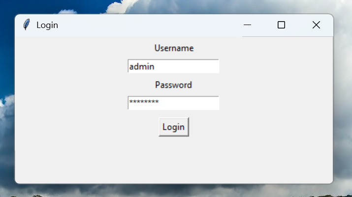
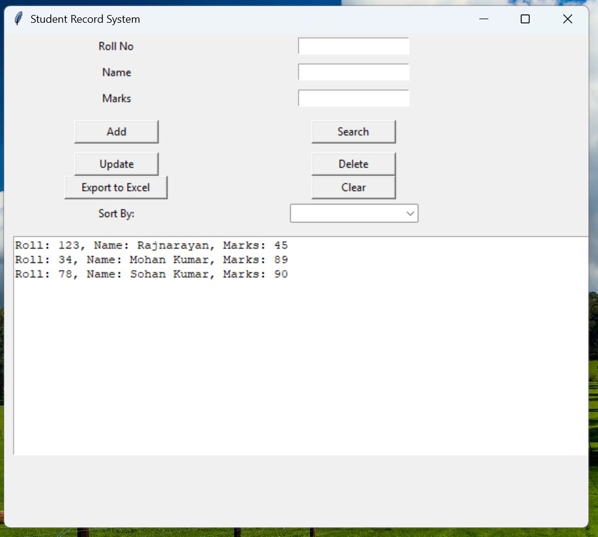
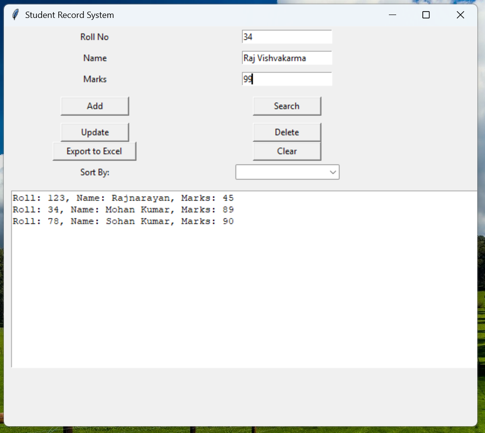
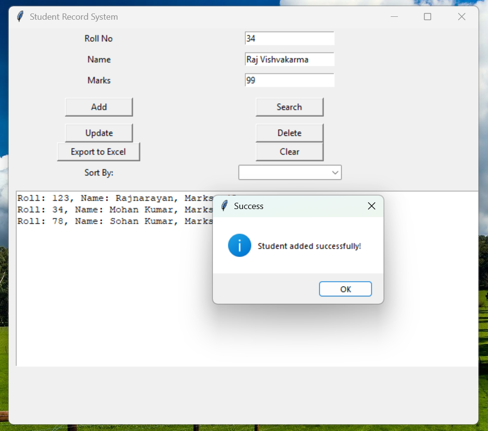

# 🧾 Student Record System (Python + Tkinter)

A GUI-based Student Record System using Python Tkinter.

### 🔐 Features:
- Admin Login (`admin / admin123`)
- Add / Search / Update / Delete Student
- Marks validation (only numbers allowed)
- Sort by Name or Marks
- Export to Excel (`students.xlsx`)

### 🖥️ Tech Stack:
- Python 3
- Tkinter (GUI)
- Pandas + OpenPyXL (for Excel export)

### ▶️ Run it:
```bash
pip install pandas openpyxl
python login.py

### 📷 Screenshots

## 🔐 Login Screen


## 🧾 Main Window


## ➕ Add Student


## 📤 Added successfully

